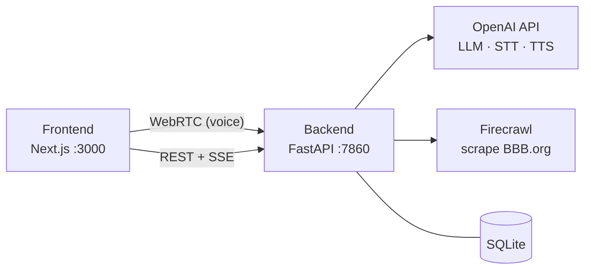

# Tavi — Facility Operations

AI-assisted work-order intake and vendor management.

## System Architecture

## Repos

| Directory | Stack | Readme |
|-----------|-------|--------|
| `frontend/` | Next.js + Pipecat client | [frontend/README.md](frontend/README.md) |
| `backend/` | FastAPI + Pipecat server | [backend/README.md](backend/README.md) |
