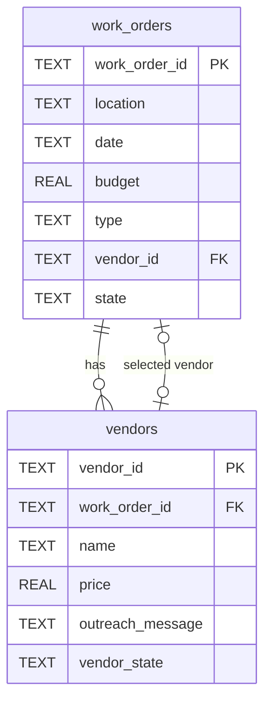
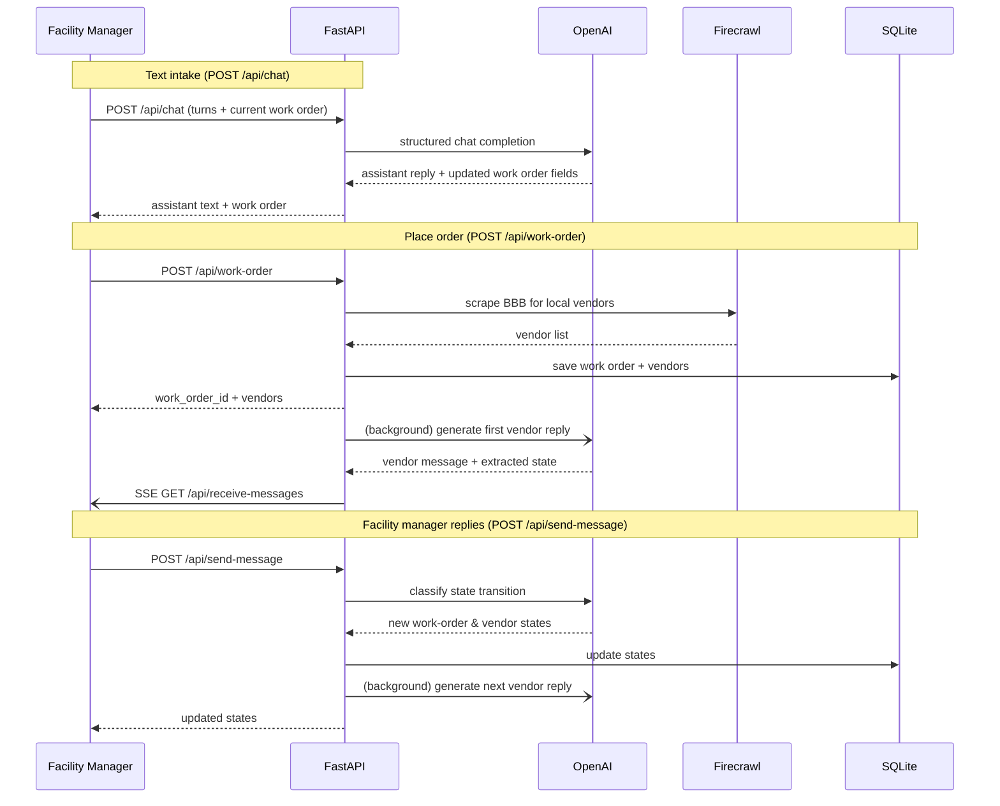
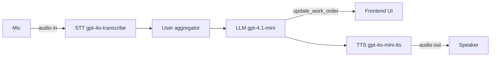
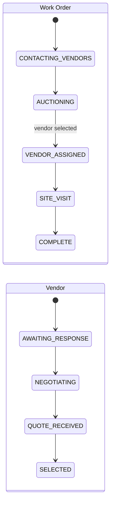

# Tavi backend

Requires Python 3.11+ and an OpenAI API key.

Get Firecrawl API key: http://firecrawl.dev

```bash
cd backend
cp .env.example .env
# Add OPENAI_API_KEY and FIRECRAWL_API_KEY  to .env
uv sync
uv pip install geopy
uv run python db.py
uv run python bot.py -t webrtc
```

In case pipecat (the voice agent framwork this project uses) throws errors or causes issues (ideally should not), 

Download the pipecat-docs mcp server and ask your coding agent of choice to set the project dependencies for pipecat up. https://docs.pipecat.ai/api-reference/context-hub#claude-code

FastAPI runs at `http://localhost:7860`; stop it with `Ctrl+C`.

The frontend uses `POST /start` for Pipecat voice sessions and `POST /api/chat`
for plain OpenAI text chat. Both return validated work-order data.

## SQLite storage and schema

Create or verify `tavi-assessment.db`:

```bash
uv run python db.py
```



## Architecture

### Work-order & vendor message flow



### Voice pipeline (`POST /start`)



### State machines




