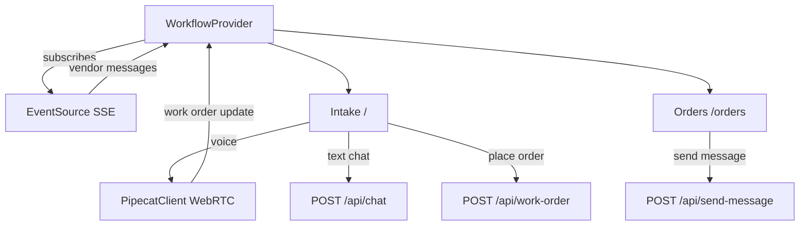

# Tavi frontend

Next.js app for work-order intake and vendor management.

## Getting Started

First, install the requirements with `npm install`.
 
 Then, start the development server:

```bash
npm run dev
# or
yarn dev
# or
pnpm dev
```

The frontend now should be running on localhost 3000
## Architecture

### Component & data flow



### Intake page modes

