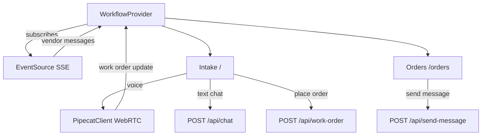
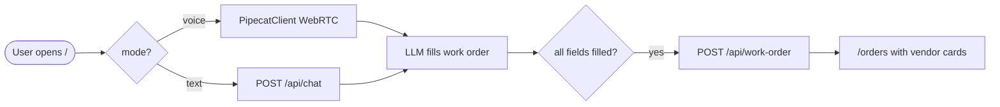

# Tavi frontend

Next.js app for work-order intake and vendor management.

## Architecture

### Component & data flow



### Intake page modes



## Getting Started

First, run the development server:

```bash
npm run dev
# or
yarn dev
# or
pnpm dev
```

Open [http://localhost:3000](http://localhost:3000) with your browser to see the result.

You can start editing the page by modifying `app/page.tsx`. The page auto-updates as you edit the file.

## Learn More

To learn more, take a look at the following resources:

- [Next.js Documentation](https://nextjs.org/docs) - learn about Next.js features and API.
- [Learn Next.js](https://nextjs.org/learn) - an interactive Next.js tutorial.
- [v0 Documentation](https://v0.app/docs) - learn about v0 and how to use it.
